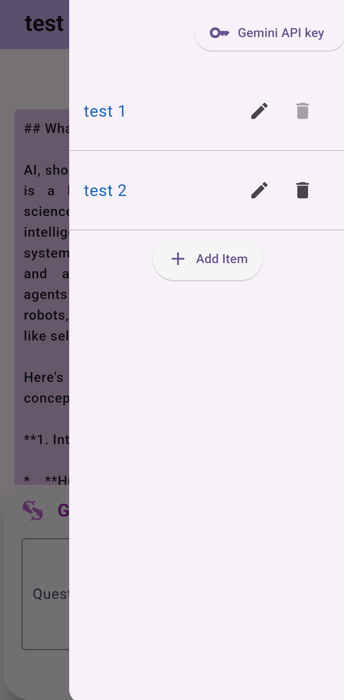

# Pisces-Chatbot
- This Flutter app is developed for learning purposes. It features a basic chatbot that integrates with the Gemini API (requires an API key for functionality) and uses a local database powered by ObjectBox for managing chat data. The app is a simple and efficient way to explore Flutter development, API integration, and database handling in mobile applications.

## Notes
- Intended for learning purposes only.
- Created for learning purposes by a beginner in Flutter programming. 
- The app is a basic example and may not receive frequent updates.
- You can obtain the Gemini API key from [Google AI Studio](https://ai.google.dev/aistudio).

## Usage Requirements:
- Minimum API Level: 21 (Android 5.0)
- Target API Level: 34 (Android 14.0)
  
## Disclaimer:
- Use at your own risk: The author is not liable for any damage to personal devices or assets. Any issues or damages that arise are the user's responsibility.
